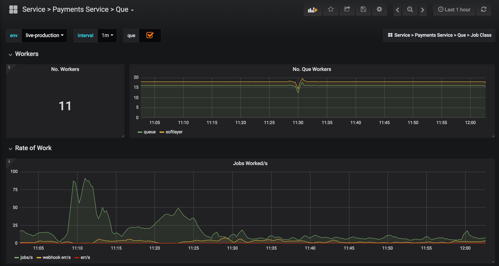
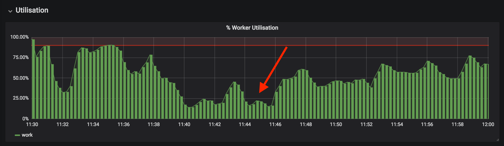
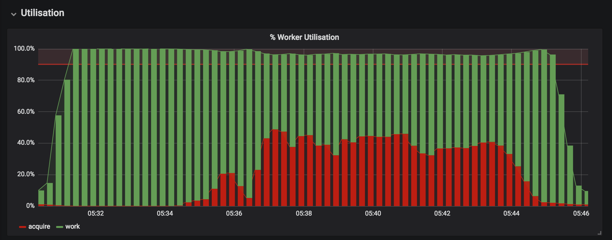
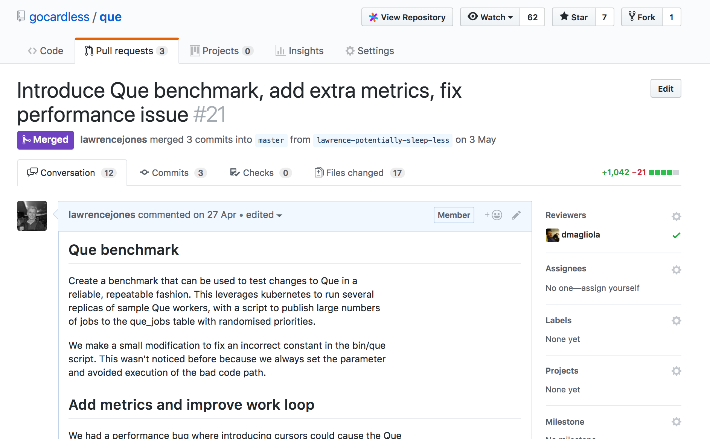
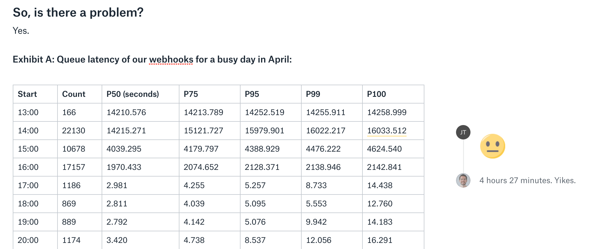
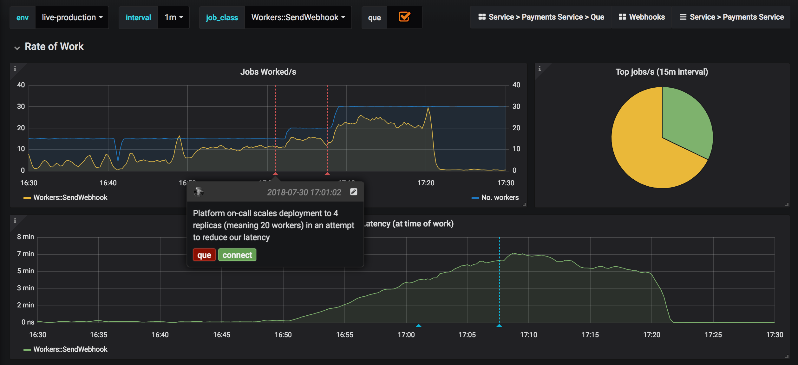
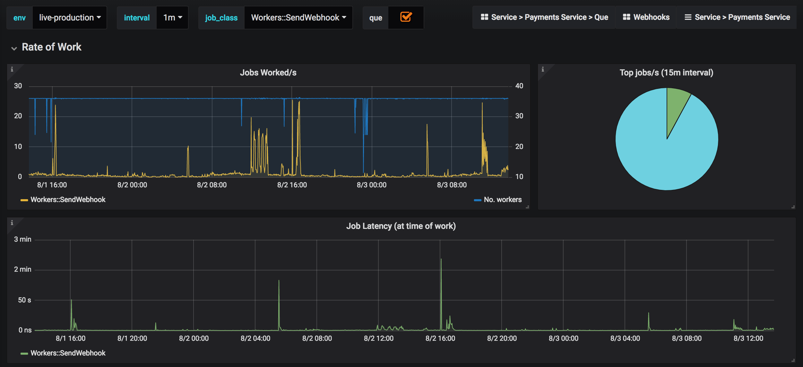

# Que

Async work in payments-service (gocardless/que)

Clean-up -> Confidence -> Customer impact

^Hey, I'm Lawrence
^Platform team
^Walk through recent changes to Que, queue system


^ Hey, for the benefit of new joiners who haven't yet met me, I'm Lawrence and
work on the Platform team at GoCardless. Today I'm going to be walking through
some of the recent changes we've made to our async work processing system, Que,
and explain how we turned a clean-up refactor into confidence, which lead in
turn to significant customer impact.

---

# Que: What is it?

> "Ruby job queue that uses PostgreSQL's advisory locks for speed and reliability"

- Transactional enqueuing
- Atomic backups
- Convenience

^ Que is the library we use to process work asynchronously in payments-service.
This can be as simple as enqueuing a job to send emails when a customer creates
a payment, to running large batch processing for the purpose of banking
pipelines. There are a few key benefits to Que that I won't go into for now, but
are summarised in this slide.

---

# Que: What is it?

```ruby
# app/workers/mail.rb
class Workers::Mail < Que::Job
  def run(recipient, subject, body)
    Sendgrid.send(recipient, subject, body)
  end
end

# Perhaps called from POST /payments ?
Workers::Mail.enqueue(
  "eng@gocardless.com", "Que", "Async workers",
  run_at: 1.hour.from_now,
)
```

^ For those who haven't used Que before, this is an example of code that
leverages the job system. We have a job called Mail which will send someone an
email. You'd define the implementation of the job in Workers::Mail, but enqueue
the job from somewhere you don't want to do the actual work. Que 'workers' will
then pickup the job and process it.

^ Simple right? The concept certainly is, but Que itself had some issues...

---

# Que: Problems

>  it looks like the build has never passed on master... 
-- GeorgeA93

- Non-idiomatic Ruby, accidental complexity, tangled code
- Rudimentary logging only
- Lack of metrics

^ We originally forked our version of Que from an open-source repository, three
years ago now. Back then Que was in a poor state: the code was tangled and
complex, it lacked any form of metrics or diagnostic logging. These issues and
more meant people would go to lengths to avoid modifying Que, and hindered our
ability to properly modify the codebase to suit our needs.

---

# Que: Outages

- Incorrect Que args halt Payouts [^1]
- Bank report processing causes degraded performance for API and background jobs[^2]
- Repeated occurrences of Que degradation impacting customers

[^1]: https://paper.dropbox.com/doc/20170612-Incorrect-Que-args-halt-Payouts--AJN_gz9MOSS4NyqtotZj96u_Ag-Lr2SPCOtUjJAnKk4KI75F

[^2]: https://paper.dropbox.com/doc/20180309-Bank-report-processing-causes-degraded-performance-for-API-and-background-jobs--AJOjn9LqJs~QKLej8NEShhLoAg-7ZGhXCJxoEnPhGzsExzpZ

^These problems led to a variety of incidents, most of which can be found in our
post-mortems collection. Code quality issues caused some fragility when calling
into Que code, and as we began to scale it became clear that some of Que wasn't
scaling with us.

^After handling some of these issues, we decided to properly assess the
situation.

---

# Que: Outages

- We need to migrate this infrastructure to GCP, with no customer impact.
- We don't trust it, can't see into it, and it has proven performance cliffs that we don't fully understand.
- We need to do something.

^GCP migration underway, we had a delicate situation coming where we'd have to
run our async workloads for four environments across two infrastructures. This
had to be achieved without any customer impact.

^Past experience had undermined our trust in Que. We knew when it went wrong,
our tooling couldn't explain in detail what had happened. We were aware it had
performance cliffs that we didn't fully understand, and couldn't pinpoint to any
one cause.

^For all of these reasons and more, we had to do something.

---

# Que: Clean-up

- Hmac & Lawrence started clean-up[^3] as hackday 2017
- Bulk of Que can now be read and understood in 270 lines of Ruby
- Foundation for future development

[^3]: https://github.com/gocardless/que/pull/11

^Luckily, one year ago Harry Mac and I had begun to clean-up Que at our company
hackathon. Frustrated with the state of the codebase, we were pretty convinced
we could write the vast majority of Que in half the code it currently existed
in.

^We achieved that rewrite, and the bulk of Que was now contained within 300
lines of Ruby. Unfortunately we never had time to integrate the new code into
payments-service, so the branch had been left untouched for some time.

^The issues we'd been having forced us to prioritise the merge of this refactor.
As soon as it was merged we began to build the features we'd been so solely
lacking...

---

# Que: Observability

- Scoped out minimum metrics to gain insight[^4]
- Implement Prometheus metrics for Que[^5]
- Can now see:
  - Number of workers running
  - What jobs are being running *at a specific moment*
  - Rate of jobs being processed, errors, etc

[^4]: https://paper.dropbox.com/doc/Scoping-Que-metrics-txee9NbEQIDzC5nmRTkaV

[^5]: https://github.com/gocardless/que/pull/14

^One of the biggest issues we had with Que was lack of observability. The
library was a queuing system with no metrics- the metrics we'd attempted to
track had some serious flaws that prevented us from trusting them, and rendered
them useless for questioning what happened at a specific moment in time.

^Raul and I took a couple of hours to scope out the metrics we wanted to see
from Que. Very lightweight, it took almost less time to then implement them into
the library. We could now see exactly how many workers are running at any one
time, which jobs were running at any moment, and the rate of jobs being
processed.

---



^This is a Grafana dashboard that exposes these metrics. As mentioned, we'd had
something like this before in datadog, but there were some serious flaws in how
those figures were computed. This was a huge step in the right direction, and
fixing one of the most critical flaws allowed us to accurately compute a metric
we'd been dying for...

---



^Worker utilisation had been one of our main frustrations with the datadog
metrics. We wanted to see how much of our worker capacity was being consumed at
any one time, precisely because we had a suspicion it wasn't being effectively
used.

^This is a graph of worker utilisation from when we first added the metrics.
It shows that our workers were actually working their jobs for varying
percentages of their lives, which looks on the surface to be fine.

^What isn't ok is that this graph is taken from a very busy day, when at 11:40am
we had hundreds of thousands of jobs in our queue.

---

# Que: Observability

- Loads of jobs, huge queue
- Worker utilisation is at <25%
- Customer impact, payouts and webhooks delayed
- MOAR METRICS!!![^6]


[^6]: https://github.com/gocardless/que/pull/21

---

```ruby
# https://github.com/gocardless/que/pull/21
@worker_running_seconds_total = register_counter(
  :que_worker_running_seconds_total, "Time since starting to work jobs",
)
@jobs_worked_seconds_total = register_counter(
  :que_jobs_worked_seconds_total, "Time taken processing each job class",
)
@worker_sleeping_seconds_total = register_counter(
  :que_worker_sleeping_seconds_total, "Time spent sleeping, because no jobs",
)
@worker_job_exists_seconds_total = register_counter(
  :que_worker_job_exists_seconds_total, "Time spent checking if job exists as part of locking",
)
@worker_job_unlock_seconds_total = register_counter(
  :que_worker_job_unlock_seconds_total, "Time spent unlocking advisory job locks",
)
@worker_job_acquire_seconds_total = register_counter(
  :que_worker_job_acquire_seconds_total, "Time spent acquiring a job locks",
)
```

^We decided to add yet more metrics to Que, this time for diagnostic purposes.
We started counting every second a Que worker ran, and dividing it into several
categories, in order to identify exactly which part of the worker code was
consuming the dead 80% of our workers time. As soon as we did this, the results
became pretty obvious...

---



^This is the same graph of worker utilisation, at a slightly different time and
with the addition of the red bars, which indicate time spent acquiring a job.
Job acquisition is something Que needs to do before ever starting work on a job,
and should be instantaneous, but was taking over 1/2 our worker time.

---

# Que: Observability

- Workers spending up-to 3/4th of time acquiring jobs
- Capacity is essentially quartered
- This has always been happening, we just couldn't see it
- But once you can see it, you can fix it...


---



^Now we knew where the problem was, it became obvious what changes we needed to
make to fix it. Within a few days we'd identified the problem and merged a fix
that would massively reduce lock acquisition time, effectively doubling our
worker capacity for peak traffic.

^Up until now I've spoken about changes in an abstract way- you know our async
work became faster, and our queue system is more robust, but I haven't mentioned
any concrete customer impact. Let's do that.

---

# Webhooks



^The Connect team are currently working on a project for customer notifications,
where webhooks will need to be sent almost as soon as they are enqueued. As part
of this project, they took measurements of the average time a webhook waits
before being sent, with a particular interest on busy days.

^It turns out that webhooks can be delayed up to 4.5hrs while they wait in our
shared Que queue to be processed. This has a huge impact on integrators, and
makes it impossible for Connect to achieve what they want to do with new
webhooks. This had to be fixed, and our recent changes to Que were instrumental
in allowing us to figure out how:

---

# Que: Customer Impact

- Worked with Connect & DE to identify Que scaling strategies[^7]
- Webhooks become the first customer facing service in GCP, with a fresh queue run entirely within kubernetes...

[^7]: https://paper.dropbox.com/doc/Scoping-improving-the-performance-of-webhook-delivery--AJPylkRHJI_RTvPip2VH2OvKAg-DXzTXaDylyHu7dBPLoBDr

^Platform worked with Connect and Developer-Enablement to identify how we should
scale Que. We did this by leveraging a benchmark suite and the existing metrics
to confirm performance characteristics of multiple queues, and verify our
strategy for splitting out webhooks.

^Because of the improved visibility around Que, Platform felt confident when
making changes as we'd be able to clearly see problems if the occurred. This
additional visibility meant we were comfortable leveraging our new GCP
infrastructure, and so the new webhooks queue became the first production,
customer facing infrastructure in GCP.

---

### Monday 30th July (peak 7m)



^On Monday the 30th July we released the new webhooks queue, and watched how it
performed a high volume day of 700k payments being submitted. We could watch in
realtime how the queue was doing, and this enabled us to scale the workers in
realtime to identify the capacity we'll need in future for this sort of
workload.

^You can see on this graph as the Platform on-call scales the number of workers
in response to increasing webhook delays, and how the increase eventually allows
us to start working webhooks faster than we generate them.

---

### Past 2 days (peak 2.5m)



^Since applying these changes, we've seen webhook delays peak at 2.5m maximum, a
massive change from the 4.5hrs we used to see.

---

# Que: Reflections

- Invest in tooling
- Manage risk with observability
- Deliver customer impact

^ It's now been a full three years since we initially forked Que, making our
changes to support flexible failure strategies. It's only in the last few months
that we spent the time to tidy up the codebase and make it possible for
engineers to make changes. Before this tidy up, GC engineers avoided making
changes to Que by building hacks into payments-service, when changes would have
been more suitable in the underlying library.

^ Had we been more proactively in taking ownership of the library, we could've
benefitted from several years of improvements, and avoided some of the growing
pains we've come to accept as normal. We need to become better at identifying
the high risk/high reward areas of our code where investment can pay off big
time, and ensure we make use of it.

^ There are many ways to mitigate risk when making changes, and in the case of
Que, ensuring we could see into our code was vital in managing it. Being able to
see what was happening lead to better understanding, which in turn gave us the
confidence to make changes.

^ Finally, work that invests in internal tooling can deliver huge customer
impact. Developing a set of high quality shared tools can open the possibility
to change the product in ways that really benefit our users. We should look for
opportunities to share and benefit from cross-team tools where appropriate.
