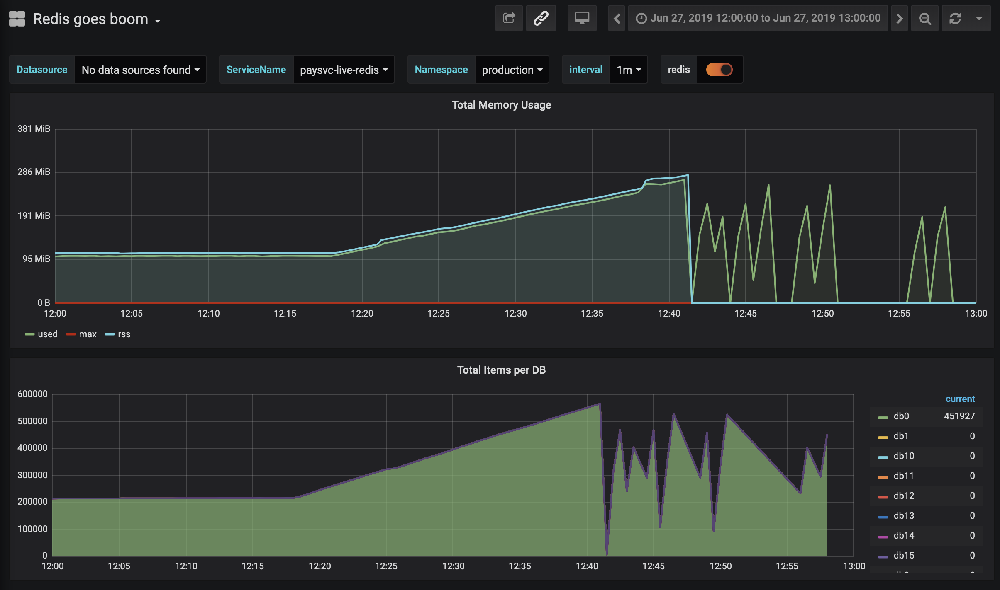
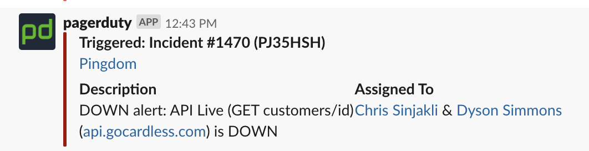

# Redis Outage (2019/06/27)

Full service outage from 12:41pm to 13:26pm (45m). What did we learn?

---

| Time | Event |
| --- | --- |
| 2019/06/27 12:17 | Start calculating merchant balances |
| 2019/06/27 12:43 | ? |
| 2019/06/27 12:56 | ? |
| 2019/06/27 13:26 | ? |

---

---

| Time | Event |
| --- | --- |
| 2019/06/27 12:17 | Start calculating merchant balances |
| 2019/06/27 12:43 | SRE's are paged |
| 2019/06/27 12:56 | ? |
| 2019/06/27 13:26 | ? |

---

---

# Ok, we're down. Why?

---

| Time | Event |
| --- | --- |
| 2019/06/27 12:17 | Start calculating merchant balances |
| 2019/06/27 12:43 | SRE's are paged |
| 2019/06/27 12:56 | SRE's identify Redis is crashing |
| 2019/06/27 13:26 | ? |

---

# It's Redis. What do we do?

---

| Time | Event |
| --- | --- |
| 2019/06/27 12:17 | Start calculating merchant balances |
| 2019/06/27 12:43 | SRE's are paged |
| 2019/06/27 12:56 | SRE's identify Redis is crashing |
| 2019/06/27 13:26 | SRE's wipe Redis data to restore service |

---

# Where did the time go?

- 13m identifying Redis
- 30m deciding what to do

---

# Faster detection

- Show me payments-service and all it's dependencies
- [What's broken? How broken?](https://grafana.gocardless.io/d/K5bz6RSWk/payments-service?orgId=1&from=1561634100000&to=1561635900000&var-datasource=Thanos%20Querier&var-logs=logging-production&var-namespace=production&var-release=paysvc-live&var-interval=1m)
- When I know what's broken, how do I fix it?

---

# Summary

- Build dashboards to help incident responders
- Make the most of post-mortems
- Document operational knowledge in runbooks
- Align SRE and developer expectations [link](https://github.com/gocardless/payments-service#infrastructure-dependencies)
- An aside: don't let perfect be the enemy of good

---

# Bonus Material

- [ElasticSearch API issues](https://grafana.gocardless.io/d/K5bz6RSWk/payments-service?orgId=1&from=1562145600000&to=1562147400000&var-datasource=Thanos%20Querier&var-logs=logging-production&var-namespace=production&var-release=paysvc-live&var-interval=1m)
- [Database outage](https://grafana.gocardless.io/d/K5bz6RSWk/payments-service?orgId=1&from=1558272168807&to=1558275343119&var-datasource=Thanos%20Querier&var-logs=logging-production&var-namespace=production&var-release=paysvc-live&var-interval=1m)
