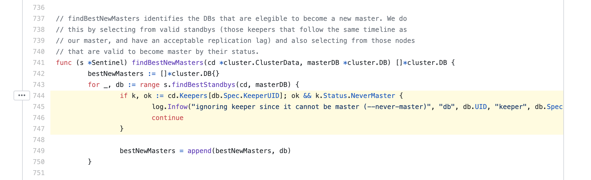
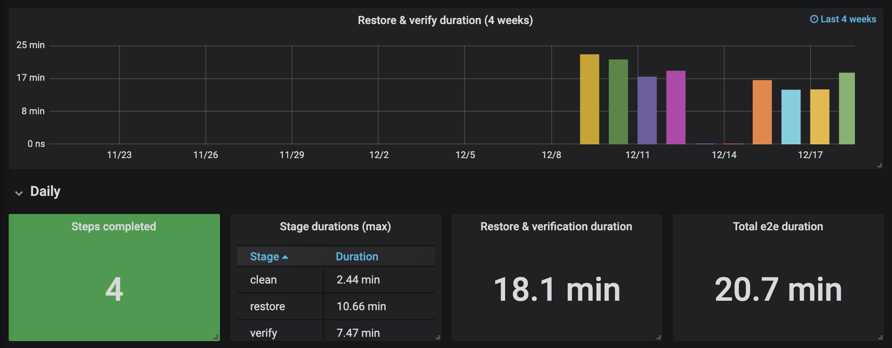

footer: lawrence@gocardless.com

# GoCardless: Scaling database backups

---

# GoCardless

- Global network for recurring, pull-based payments
- `POST /payments`
- 400 people, 5 offices worldwide

---

# Me

- Tech lead of Core Infrastructure, 6 SREs, PM & EM
- Support GoCardless engineers with reliable infrastructure
- Consult with developers on how to leverage tools

---

# A project in the life of an SRE

- Set the **scene**
- Walkthrough **plan**
- Reflect on **outcomes**

---

# Scene

---

# Scene: Monolith

- Payments-Service powers our API
- Rails app using Postgres, database is 3TB x 2^n
- Payment data is important, should probably back it up...

---

# Scene: Legacy Postgres backups

- Heap `/data/postgres`
- WAL `/data/postgres/pg_{xlog,wal}`
- Barman takes full copies of heap, collects WAL continuously

---

# Scene: Good backups

> Last backup taken at 1pm. Database is destroyed at 1:05pm. Recover at 1:30pm.

---

# Scene: Good backups

- RTO: Recovery time objective (25m, 1:05->1:30)
- RPO: Recovery point objective (5m, 1:00->1:05)

---

# Scene: Goals

- RTO is 30m (99.95%)
- RPO is 1m (1000 payments)

---

# Scene: Problems

- Speed limit, 440MB/s, 2-4hrs
- Data is money

---

# Scene: Breaking the speed limit

- Disk snapshots don't have this limit
- Incremental, scale sub-linerly
- <3m to create, <10m to restore, non-lazy

---

# Plan

---

## Plan: Step 1, nominate backup node

---


---



---


---

```
=== Cluster Info ===

Master Keeper: stolon_production_1

===== Keepers/DB tree =====

stolon_production_1 (master)
└─stolon_production_2 (sync)
  ├─stolon_production_0 (async)
  └─stolon_async_production_0 (async)
```

---

## Plan: Step 2, schedule & prune backups

---

```ruby
# Chef configuration management code (Ruby DSL)
disk_snapshot_schedule("/data") do
  snapshot_frequency("*:0/15")

  # Keep all backups under 3 days old at 15m intervals, ...
  retention_windows(
    "3d": "15m",
    "1w": "1h",
    "4w": "1d",
    "1y": "1w",
    "*":  "4w",
  )
end
```

---


---


---

## Plan: Step 3, ship WAL

---

```toml
# Ship new WAL segments to GCS
archive_command = "gsutil %p gc-prd-postgresql-wal/%f"
```

---

```
# Google Cloud Storage -> Amazon S3
resource "google_cloudfunctions_function" "wal_to_s3" {
  name        = "wal-to-s3"
  runtime     = "go113"
  description = "Copy WAL segments to S3 off-site storage"

  event_trigger {
    event_type = "google.storage.object.finalize"
    resource   = "projects/${var.project}/buckets/${module.wal_archive.bucket}"
  }

  ...
}
```

---

# Outcomes

---

## Outcomes: RTO & RPO

- Recovery within 20m
- Loses <1m data
- Success?

---

## Outcomes: ABR

- Your backups are broken
- Test them, or don't bother at all!
- ABR: Automated backup recovery...

---


---



---


---

# Take-aways

- Establish constraints, work until you meet them
- When things are fast, you open new doors
- Correct technology choice can have big impact (5x savings)
- Work to a technical vision

---

- We're hiring! (all eng roles)
- More content at:
  - https://gocardless.com/blog/debugging-the-postgres-query-planner/
  - https://blog.lawrencejones.dev/building-a-postgresql-load-tester/
