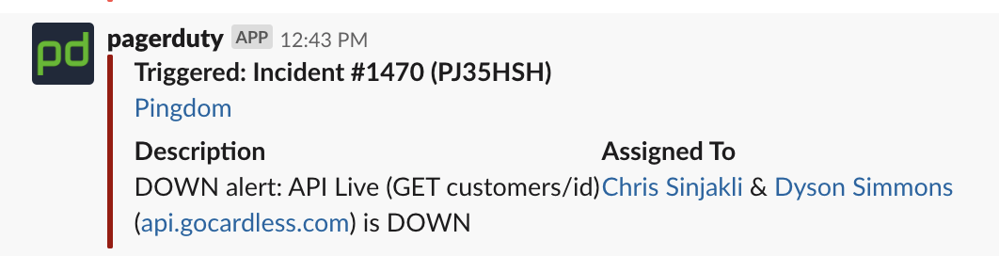

footer: lawrence@incident.io
theme: Plain Jane, 2

# Handling incidents

---

# Me

- Background at GoCardless, Principal SRE
- Worked on large scale infrastructure
- Dealt with a lot of incidents
- Now at incident.io, as an engineer

---

# What is an incident?

- Can range in size and scope
- Might be purly engineering
- But one thing is certain...

---

# What is an incident?

- You will have them.
- That's why it's important to learn how to handle them!

---

# Case Study: Redis Outage

Full service outage from 12:41pm to 13:26pm (45m).

What happened, and what did we learn?

---

| Time | Event |
| --- | --- |
| 2019/06/27 12:17 | Start calculating merchant balances |
| 2019/06/27 12:43 | ? |
| 2019/06/27 12:56 | ? |
| 2019/06/27 13:26 | ? |

---

---

| Time | Event |
| --- | --- |
| 2019/06/27 12:17 | Start calculating merchant balances |
| 2019/06/27 12:43 | SRE's are paged |
| 2019/06/27 12:56 | ? |
| 2019/06/27 13:26 | ? |

---

---

# Ok, we're down. Why?

---

| Time | Event |
| --- | --- |
| 2019/06/27 12:17 | Start calculating merchant balances |
| 2019/06/27 12:43 | SRE's are paged |
| 2019/06/27 12:56 | SRE's identify Redis is crashing |
| 2019/06/27 13:26 | ? |

---

# It's Redis. What do we do?

---

| Time | Event |
| --- | --- |
| 2019/06/27 12:17 | Start calculating merchant balances |
| 2019/06/27 12:43 | SRE's are paged |
| 2019/06/27 12:56 | SRE's identify Redis is crashing |
| 2019/06/27 13:26 | SRE's wipe Redis data to restore service |

---

# Service is restored, all good now.

---

# But how do you run an incident like this?

---

# The lifecycle of an incident

- First five minutes
- During
- After impact, before close
- After close

---

# First five minutes

- Possibly the most crucial stage
- There is an opportunity to set things up well, or to send people in the wrong direction
- How do we run this?

---

# Incident roles

---

# Incident roles

- Why? Roles help separate responsibilities
- Incidents get hectic, you don't want to step on people's toes
- Responders with less experience might not know how to be effective

---

# Incident roles: Commander (or lead)

- Single point of contact for actions taken
- Coordinates the team, nothing happens without them being aware
- Avoids accidentally colliding (you turned off _what_ database?)

---

# Incident roles: Communications

- Communicates status of incident outside of the team
- Can manage stakeholders as they come asking questions
- Helps relieve other responders

---

# So back to first five minutes...

- Assign roles, and make it clear!
- Then start assessing the problem

---

# While you're responding

- Communicate everything- ideally in writing
- That communication should (ideally) be public
- Log any destructive action
- Think about rolling back before committing

---

# As soon as you can... take a break!

- Whenever you get a chance, step away from keyboard
- Take pauses when:
  - You get paged
  - Production impact has ceased
  - During follow-up, before any procedure

---

# Find what's bleeding

- Identify which systems are failing
- Work through their dependencies
- Be wary of assumptions
- Aim to estimate incident impact, as soon as is sensible

---

# Stop the bleeding

- Your focus is on limiting impact, not fixing the root problem
- Take action to preserve critical systems, even at expense of less critical ones
- Make full use of your team to explore options- delegation is key

---

# After the impact, before the close

- Most incidents have this stage
- Slow down here, and finish what you're doing before continuing
- Communicate clearly about what remains, and document anything you might forget

---

# Finally, closing

- Once the actions are clear, you need to prepare for a review
- Someone writes a post-mortem
- Books an incident review
- Tickets remaining work

---

# Questions!

---

# Previous incidents

- Large PostgreSQL outage, technical, 1hr 45m
- Security incident due to external service XSS, technical, days
- Thomas Cook closing, large business impact, weeks
