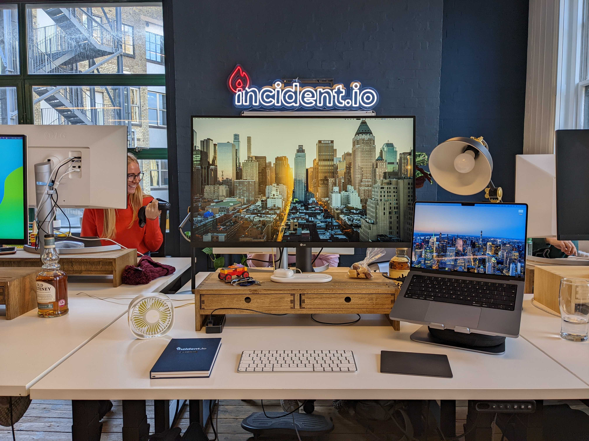

footer: 🔥 incident.io | @lawrjones | https://lawrencejones.dev/
theme: Plain Jane, 2
build-lists: true

# Growing into Platform Engineering

^ Hey everyone, I'm here today to talk about Growing into Platform Engineering.

^ Before I do, let's do some intros.

---

# Me

[.build-lists: false]

- Lawrence Jones (@lawrjones)
- Product Engineer at 🔥incident.io
- We're growing, fast.
- What is our plan for infrastructure?

^ I'm Lawrence Jones, and work as a Product Engineer at incident.io, where I
build incident response tooling that helps companies respond at scale.

^ That's useful context, as incident is core to how I was thinking about this
talk. Basically, we're growing, and we're doing it fast: I joined as the first
hire back in August, but we're already on our fourth office after hiring about
35 people.

^ My focus is on the engineering team, and one question I've been asking myself
has been how will we handle infrastructure in this company?

^ Specifically...

---

# What is our plan for infrastructure?

[.build-lists: false]

- Do we hire a Platform team?
- Remit?
- What do we need to make that successful?

^ We could jump in at the deep end, hiring a large team to build a fancyu
internal developer platform, but that seems premature for our stage.

^ In fact, there are many pragmatic steps between start-up and that situation
that you can take which ease the journey, with an acceptable up-front cost to
implementating them.

^ This talk will share two anecdotes from my previous team, where we did just
this. They come from my time at GoCardless where we grew Platform Engineering
alongside the company, and I'll set each scene with the size of the company at
the time, so you can understand the context.

^ Let's dive in.

---

# Chapter 1. Platform software is just software, you're not special.

---

> Q1 2018
> Platform: 4 engineers
> Engineering: 35+

---

# Problem

- Migrating from Softlayer to GCP
- Deployments go both places
- We have a script, but distribution is hard

^ deploying to dev laptops difficult

^ we're going to write more

^ need it to be good

^ and we realised:

---

# This is just another software problem

---

# We like to think we're special

[.build-lists: false]

- "This is too hard to test!"
- "There's end-to-end, then there's this..."
- "Can I even get a Kubernetes cluster on my local machine?"

^ PE often think we're special

^ in fact, we typically do hard stuff, and that means applying best practices
can be hard

^ but don't avoid it, make it easy to do the right thing

---

# So what can we do?

1. Make a home
2. Continuous deploy, but for _our_ stuff
3. Deploy it everywhere

^ make a home for this new code

^ easy to add more software over time

^ because of this, you can invest in CI, linting, testing

^ next, CD: but for us!

^ you know the value of CD, you will have advocated for it

^ but you often skip your own tools. don't.

^ ship faster -> ship more -> deliver

^ merge to master would build the binary, tag new version, update a homebrew tap
so devs could pull the latest

^ finally, deploy everywhere

^ if you're going to put everything here, then make sure it gets put everywhere

^ we pushed to our debian package to install on our VMs. and installed it in our
base container.

^ everywhere in our infra would have this tool, updated constantly

---

# Chapter 2. You can't sell a product no one wants.

---

> Q2 2021
> Platform: 7 engineers
> Engineering: 200+

---

# Problem

- Self-service has been achieved
- We even had a tutorial[^1] for new joiners to setup a toy service
- Just one issue...

[^1]: See this tutorial at: https://blog.lawrencejones.dev/utopia-tutorial

---

# No one was using it.

---

# Adoption

- Was inconsistent, varying across teams
- Those who used it, loved it
- So why wasn't everyone?

---

# Misalignment.

> "But you guys handle this stuff, right?"

---

# Platform Engineers are prone to this

- You are not your customer
- Those you work closely with, are not representative
- It helps to realise...

---

# Platform Engineering is a intense, complex, and confounding Product problem...

## ...and it pays to recognise this.

---

# Treat it like a Product problem, and it'll be easier.

---

# Round up

- You're not special: embrace software engineers best practices
- Platform Engineering is Product engineering

---

# Sound good?

### lawrence@incident.io
