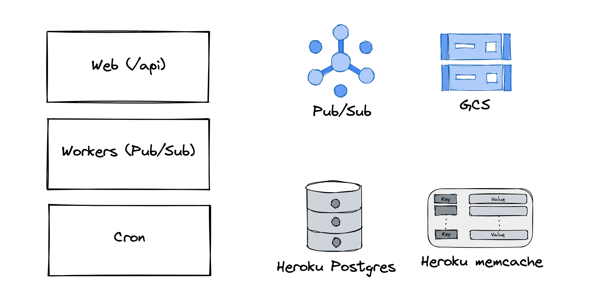
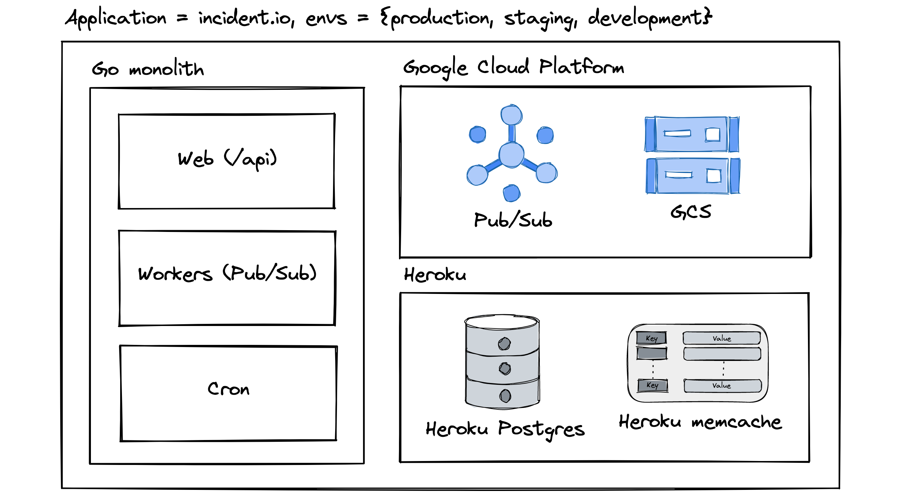
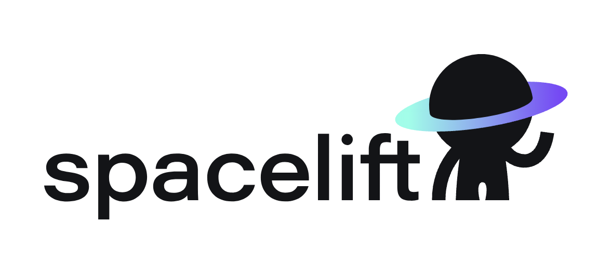
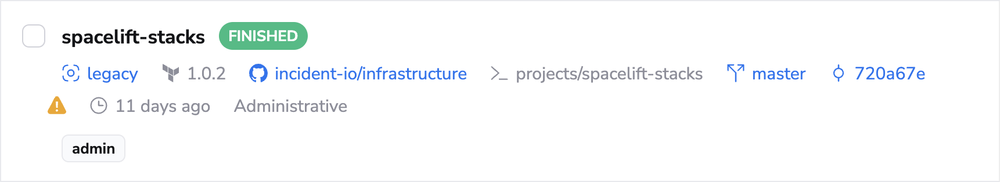
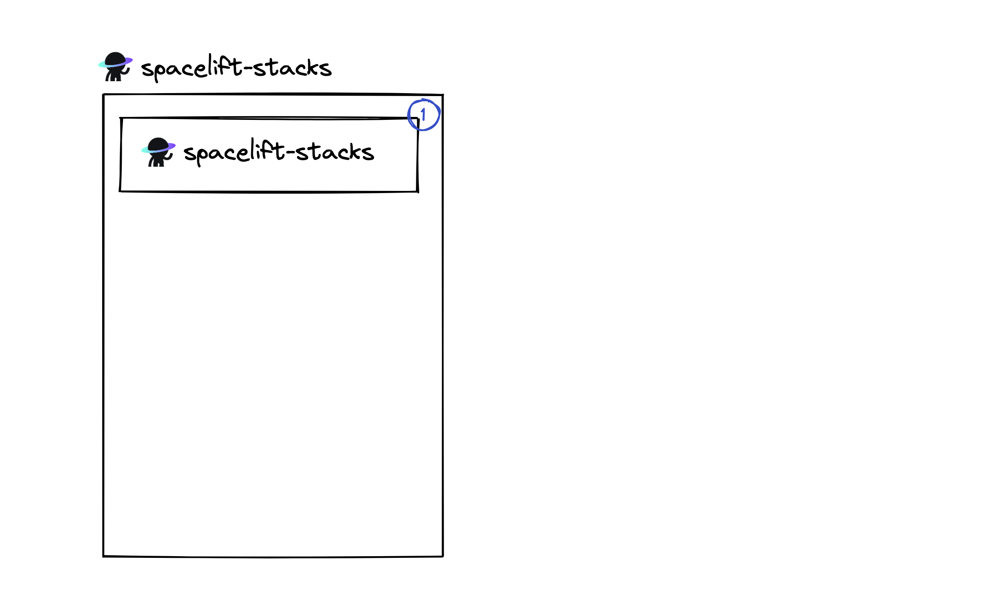
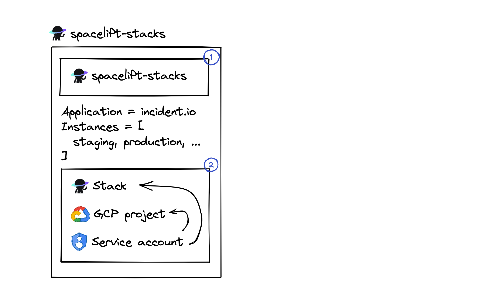
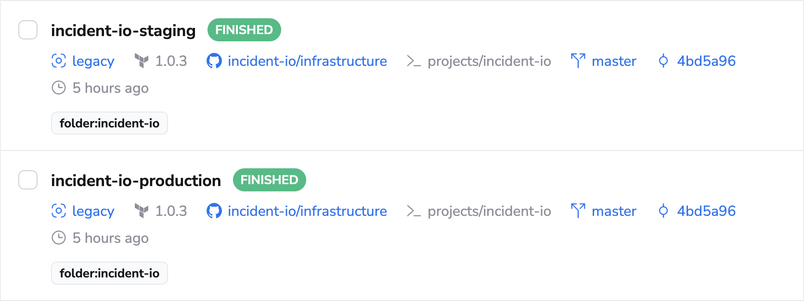
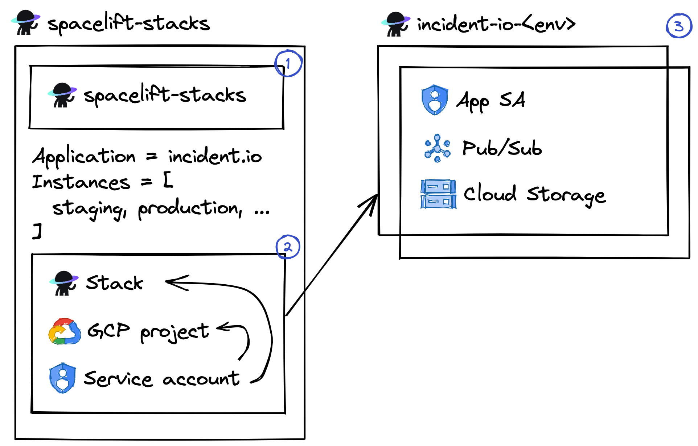

footer: 🔥 incident.io | @lawrjones | https://lawrencejones.dev/
theme: Plain Jane, 2
build-lists: true
slidenumbers: true
slidecount: true

# Getting Cloud right, from the start

---

# Me

[.build-lists: false]

- Lawrence Jones (@lawrjones)
- Product Engineer at 🔥incident.io
- Previously: Principal SRE at GoCardless

---

# Getting Cloud right, from the start

---

# Starting from scratch

[.build-lists: true]

- First hire, very little legacy
- What exists is simple and works
- Where do we go from here?

---

# What is 'right'?

---

# What is 'right'?

- Simple
- Consistent
- Secure by default
 
---

# Table stakes

[.text: alignment(center)]
[.footer-style: alignment(left)]
[.slidenumber-style: alignment(right)]

1. Find a model for an 'application' and 'environment'
2. Use infrastructure as code for everything production
3. Each developer gets their own environment for local dev

---

# Find a model for an 'application' and 'environment' 

---

[.footer: ]


---

# Let's add some structure...

---

[.footer: ]
[.background-color: #FFFFFF]


---

# What environments do we need?


---

# Will environments share resources?


---

# What would an ideal dev environment look like?


---

[.text: alignment(center)]

# Decisions...

- Each environment gets a Google project
- Service account for GCP services
- Create staging & production Heroku
- Each developer has real GCP/docker-compose Heroku

---

# Table stakes (1/3)

[.build-lists: false]
[.text: alignment(center)]
[.footer-style: alignment(left)]
[.slidenumber-style: alignment(right)]

1. Find a model for an 'application' and 'environment' ✅
2. Use infrastructure as code for everything production
3. Each developer gets their own environment for local dev

---

# Use infrastructure as code for everything production

---

# Use infrastructure as code for everything production

1. Run terraform
2. Create an environment
3. Provision resources

---

# 1. Run terraform



---

# 1. Run terraform

- Create 'superadmin' Stack (`spacelift-stacks`)
- Grant permissions to attached service account
- Import into itself

---

```
# projects/spacelift-stacks/main.tf
resource "spacelift_stack" "spacelift_stacks" {
  name         = "spacelift-stacks"
  description  = "Configuration of Spacelift stacks"
  repository   = "infrastructure"
  branch       = "master"
  project_root = "projects/spacelift-stacks"

  # This stack controls other stacks:
  administrative = true
}
```

---



---

[.footer: ]


---

# Use infrastructure as code for everything production

[.build-lists: false]

1. ~~Run terraform~~ => Spacelift
2. Create an environment
3. Provision resources

---

# 2. Create an environment

---

```
module "incident_io" {
  for_each = {
    "staging" = {
      project = "incident-io-staging"
    }
    "production" = {
      project = "incident-io-production"
    }
  }

  source = "./modules/stack"

  application       = "incident-io"
  instance          = each.key
  google_project_id = each.value.project
}
```

---

[.column]

[.header: alignment(left)]

# 2. Create an environment

[.build-lists: false]

<br/>

- Create Spacelift stack (e.g. `incident-io-staging`)
- Create GCP project
- Create admin service account

[.column]

```
module "incident_io" {
  for_each = {
    "staging" = {
      project = "incident-io-staging"
    }
    "production" = {
      project = "incident-io-production"
    }
  }

  source = "./modules/stack"

  application       = "incident-io"
  instance          = each.key
  google_project_id = each.value.project
}
```

---

[.footer: ]


---

# Use infrastructure as code for everything production

[.build-lists: false]

1. ~~Run terraform~~ => Spacelift
2. ~~Create an environment~~ => terraform module, separate stack
3. Provision resources

---

# 3. Provision resources

---

[.column]
```
projects/incident-io
├── _staging.tfvars
├── _production.tfvars
├── README.md
├── iam.tf
├── main.tf
├── pubsub.tf
├── stackdriver.tf
├── storage.tf
└── variables.tf
```

[.column]
```
# projects/incident-io/_staging.tfvars
project            = "incident-io-staging"
environment        = "staging"
images_bucket_name = "incident-io-images-staging"

# projects/incident-io/_production.tfvars
project            = "incident-io-production"
environment        = "production"
images_bucket_name = "incident-io-images"
```

---



---

[.footer: ]
[.background-color: #FFFFFF]


---

# Use infrastructure as code for everything production

[.build-lists: false]

1. ~~Run terraform~~ => Spacelift
2. ~~Create an environment~~ => terraform module, separate stack
3. ~~Provision resources~~ => terraform project, separate tfvars

---

# Table stakes (2/3)

### Find a model for an 'application' and 'environment' ✅
### Infrastructure as code for anything production ✅
### Each developer gets their own environment for local dev

---

# Each developer gets their own environment for local dev

---

```diff
 module "incident_io" {
   for_each = {
     "staging" = {
       project = "incident-io-staging"
     }
     "production" = {
       project = "incident-io-production"
     }
+    "dev-lawrence" = {
+      project    = "incident-io-dev-lawrence"
+    }
   }
 
   source = "./modules/stack"
 
   application       = "incident-io"
   instance          = each.key
   google_project_id = each.value.project
 }
```

---

# Table stakes (3/3)

### Find a model for an 'application' and 'environment' ✅
### Infrastructure as code for anything production ✅
### Each developer gets their own environment for local dev ✅

---

# Is it right? (simple, consistent, secure)

- Three lines of code for a new environment
- All applications deployed the same way
- Works with GCP IAM for least privilege
- Only one pipeline has 'superadmin'
- Keyless, short-lived credentials

---

[.column]

It's worked ok, so far.

https://github.com/incident-io/infrastructure-example

[.column]
```
projects
├── cicd
│   └── _production.tfvars
├── data
│   ├── _production.tfvars
│   └── _production.tfvars
├── data-incoming
│   ├── _production.tfvars
│   └── _production.tfvars
├── domains
│   └── _production.tfvars
├── incident-io
│   ├── _dev-aaron.tfvars
│   ├── _dev-alex.tfvars
│   ├── _dev-alicia.tfvars
│   ├── _dev-andy.tfvars
│   ├── _dev-benji.tfvars
│   ├── _dev-charlie.tfvars
│   ├── _dev-chris.tfvars
│   ├── _dev-dimitra.tfvars
│   ├── _dev-isaac.tfvars
│   ├── _dev-kelsey.tfvars
│   ├── _dev-lawrence.tfvars
│   ├── _dev-lisa.tfvars
│   ├── _dev-martha.tfvars
│   ├── _dev-milly.tfvars
│   ├── _dev-pete.tfvars
│   ├── _dev-rory.tfvars
│   ├── _dev-sam.tfvars
│   ├── _dev-sophie.tfvars
│   ├── _dev-walt.tfvars
│   ├── _production.tfvars
│   └── _staging.tfvars
├── interview
│   └── _production.tfvars
├── jira-server
│   └── _development.tfvars
├── observability
│   ├── _lab.tfvars
│   └── _production.tfvars
├── operations
│   └── _production.tfvars
└── web-proxy
    ├── _lab.tfvars
    └── _production.tfvars
```
