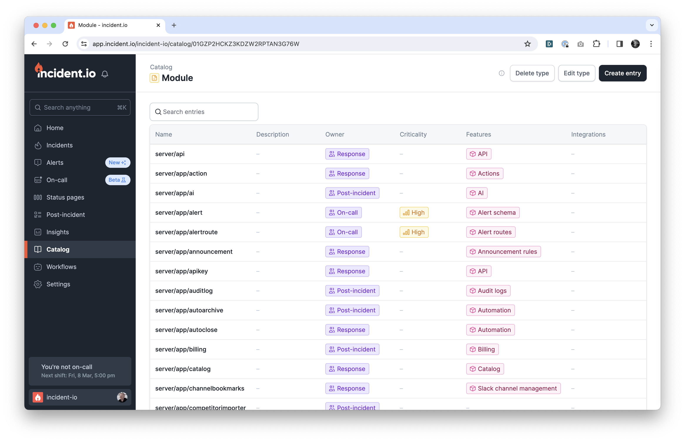
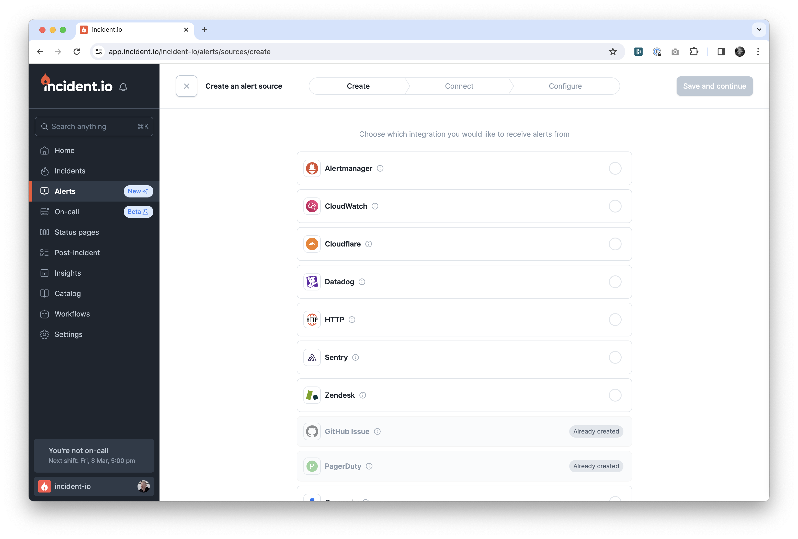
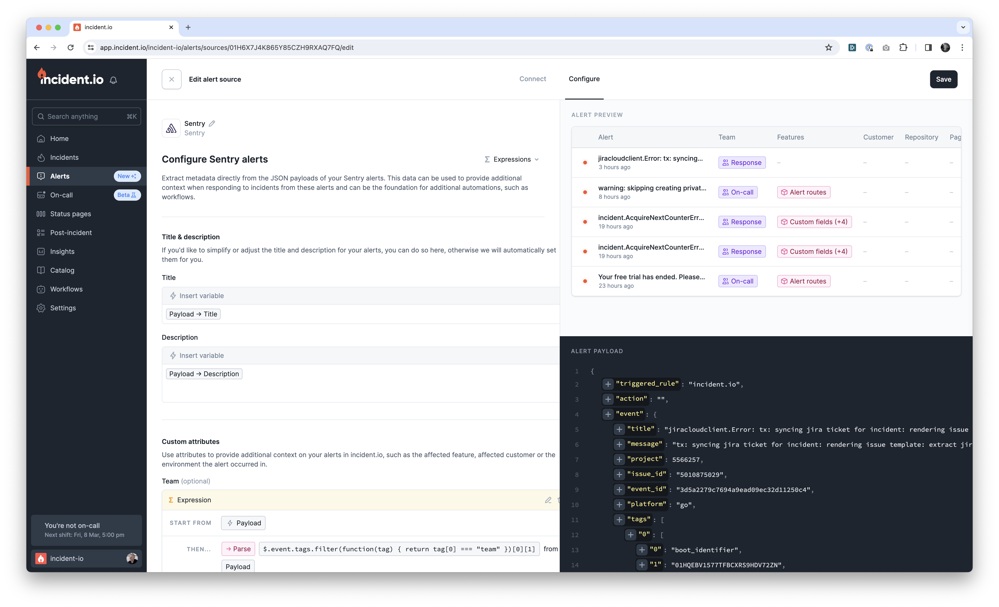
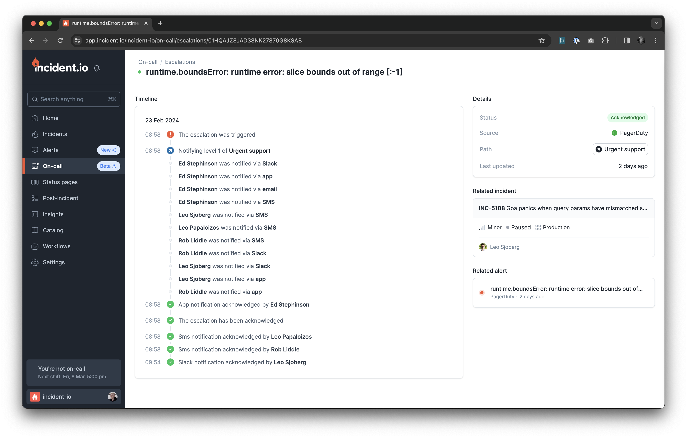
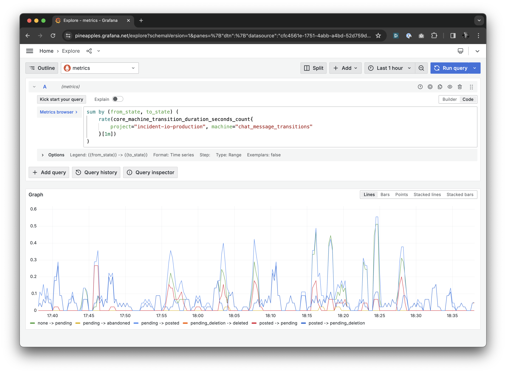
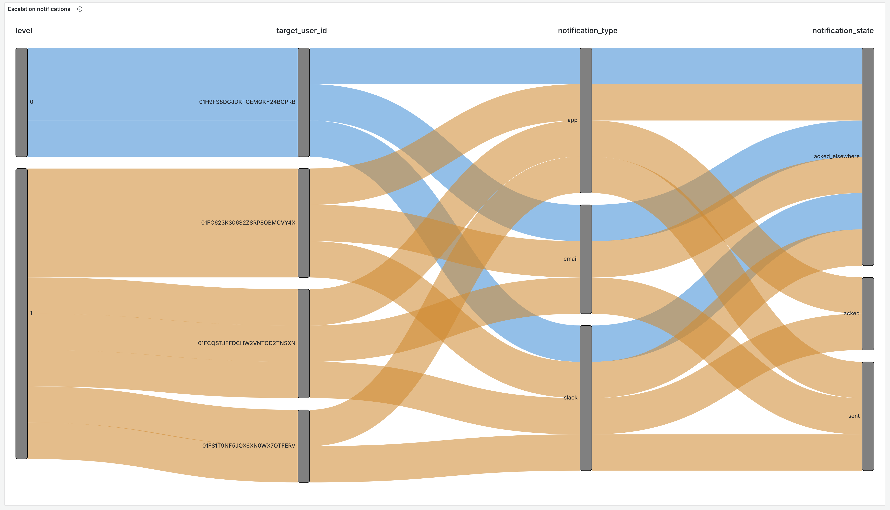

theme: Plain Jane, 2
text: Inter Tight, #ffffff
text-strong: Inter Tight Bold, #EE783F
header: Inter Extra Bold, #53585F
footer: incident.io | @lawrjones | https://lawrencejones.dev/
build-lists: true
slidenumbers: true
slidecount: true

# Our favourite Go patterns

---

# Me

[.build-lists: false]

- Lawrence Jones (@lawrjones)
- Product Engineer at 🔥incident.io
- 1st to 30 engineers, 1M Go LoC, 20k pull requests

---

# Let's start at the beginning.

---

# Why Go?

- Founders knew it from Monzo
- Got started quickly, but...
- We're not like Monzo.

---

# What does our ideal codebase look like?

- Ensure consistency
- Find opportunities to extract patterns
- Prioritise developer time/experience

---

# The incident.io system

- Monolith
- Postgres
- Pub/Sub

---

# Patterns

1. Code structure
2. Registry
3. Machine
4. Observability

---

# Code structure

- Web dashboard for viewing and managing incidents.
- Slack app to drive incident response.
- Public API for customers to build integrations.
- Alert receiver that ingests, filters and routes pages.
- Mobile app to deliver notifications and provide incident updates.

---

Diagram of web, Slack, and an alert showing how each of these surfaces called
directly into creating an incident database row after applying their own
validation.

---

# We need DRY!

---

```go
// app/incident/create.go
package incident

// Create is the only way we create an incident across the product.
func Create(
    ctx context.Context,
    db *gorm.DB,
    identity *rbac.Identity,
    payload *common.IncidentPayload,
) (
    *domain.Incident, error
) {
    // ...
}
```

---

# What this gets us

- Composition
- Extendable by returning `domain`
- Receives `common` so default-compatible with our API
- No authentication or serialization concerns

---

As before a diagram of web, Slack, and an alert but this time showing how the
code that powers each of these calls into a shared app/incident.Create function.

---

[.column]

```
app/alert
├── README.md
├── activate_source_config.go
├── api
│   ├── service.go
│   ├── service_events_v2.go
│   ├── service_test.go
│   └── suite_test.go
├── backfill_alert_attribute_values.go
├── backfill_alert_attribute_values_test.go
├── build_alerts.go
├── build_source_config.go
├── create_draft_source_config.go
├── destroy_source_config.go
├── enqueue_handle_event.go
├── enqueue_handle_event_test.go
├── entry_cache.go
├── evaluate_attributes.go
├── evaluate_attributes_test.go
├── filters
│   ├── alert_source.go
│   ├── attributes.go
│   ├── created_at.go
│   ├── filter.go
│   ├── full_text_search.go
│   ├── id.go
│   └── status.go
├── get_config.go
├── handle_event.go
├── handle_event_test.go
├── incoming
│   ├── handle_github_issue.go
│   ├── handle_github_issue_test.go
│   ├── handle_opsgenie.go
│   ├── handle_pager_duty.go
│   ├── handle_pager_duty_test.go
│   ├── handle_sentry.go
│   ├── handle_sentry_test.go
│   ├── handle_zendesk.go
│   ├── subscribers.go
│   └── suite_test.go
├── list_sources.go
├── module.jsonnet
├── params.go
├── preview_alerts.go
├── resolve.go
├── retrigger.go
├── sources
│   ├── source.go
│   ├── source_alert_manager.go
│   ├── source_cloudflare.go
│   ├── source_cloudwatch.go
│   ├── source_datadog.go
│   ├── source_github_issue.go
│   ├── source_http.go
│   ├── source_opsgenie.go
│   ├── source_page_view_spikes.go
│   ├── source_pagerduty.go
│   ├── source_sentry.go
│   ├── source_test.go
│   ├── source_zendesk.go
│   └── suite_test.go
├── subscribers.go
├── suite_test.go
├── update_schema.go
└── update_source_config.go
app/alertroute
├── README.md
├── api
│   ├── serialize.go
│   ├── service.go
│   ├── service_alert_operations.go
│   ├── service_alert_route_configs.go
│   ├── service_alert_route_configs_test.go
│   ├── service_alert_route_scope.go
```

[.column]

We now have ~100 packages in `app`, such as:

- `app/alert` => ingestion of alerts.
- `app/schedule` => managing on-call schedules.
- `app/escalator` => creates on-call escalations to page people.

With related sub-packages.

---



---

# Patterns

1. Code structure ✅
2. Registry
3. Machine
4. Observability

---

# Registry

---



---



---

[.column]

```
app/alert/sources
├── source.go
├── source_alert_manager.go
├── source_cloudflare.go
├── source_cloudwatch.go
├── source_datadog.go
├── source_github_issue.go
├── source_http.go
├── source_opsgenie.go
├── source_page_view_spikes.go
├── source_pagerduty.go
├── source_sentry.go
├── source_test.go
├── source_zendesk.go
└── suite_test.go
```

[.column]

- We need to model the 'generic' source
- Each source implements an interface
- We add it to the 'registry'

---

[.column]

```go
// AlertSource is the interface implemented by all sources. The implementations are added
// to a package registry, and retrived/build via package functions.
type AlertSource interface {
	// Type returns the name of this alert source.
	Type() domain.AlertSourceType

    // Class is configurable, integration, or native.
	Class() domain.AlertSourceClass

	// Name is how we refer to the source in any user facing labels.
	Name() string

	// Docstring is an explanation of this source.
	Docstring() string

	// Requires specifies the integrations needed to power this alert source.
	Requires() []domain.IntegrationProvider

	// NeedsSetup specifies whether the integration needs to communicate back to us to finalise setup.
	// See AlertSourceSetupComponent on the frontend.
	NeedsSetup() bool

	// ExamplePayload returns an example of a payload that this source expects to receive.
	ExamplePayload() any

	// New builds a new instance of this alert source, using the provided payload.
	New(payload any) (AlertSource, []byte, error)

	// Payload returns the payload loaded into this source, if it has been initialised.
	Payload() any

	// DeduplicationKey returns the deduplication key of the alert.
	DeduplicationKey() *string

	// Title returns the title of the alert.
	Title() *string

	// Description returns the description of the alert.
	Description() *string

	// SourceURL returns the source URL of the alert.
	SourceURL() *string

	// Status returns the status of the alert.
	Status() *domain.AlertStatus

	// scope builds any dynamic scope variables associated with this source. Note this is
	// not about using any custom rules provided by users: it's just about what this alert
	// source returns, and it will be the same for all organisations.
	scope(
		ctx context.Context,
		db *gorm.DB,
		org *domain.Organisation,
		reg *engineresources.Registry,
	) (
		*engineresources.Scope, error,
	)
}
```

[.column]

```go
// source.go
var (
	registry   = map[domain.AlertSourceType]AlertSource{}
)

func register(source AlertSource) {
	registry[source.Type()] = source
}


// source_sentry.go
func init() {
	register(SourceSentry{})
}

type SourceSentry struct {
	payload *SourceSentryPayload
}

func (s SourceSentry) Type() domain.AlertSourceType {
	return domain.AlertSourceTypeSentry
}

func (s SourceSentry) Name() string {
	return "Sentry"
}

...
```

---

[.column]

```go
// app/alert/sources/source.go

// New builds an alert source from the payload.
func New(sourceType domain.AlertSourceType, payload any) (
    AlertSource, []byte, error,
) {
    // ...
}

// Get retrives the AlertSource with this type name.
func Get(name domain.AlertSourceType) AlertSource {
    // ...
}

// All returns a list of all registered alert sources.
func All() []AlertSource {
    // ...
}
```

[.column]

```go
// app/alert/api/service.go
func (svc *Service) ListSources(ctx context.Context) (*alerts.ListSourcesResult, error) {
	sources, err := alertsources.All()
	if err != nil {
		return nil, err
	}

	res := &alerts.ListSourcesResult{
		AlertSources: serialize.Map(sources, serialize.AlertSource),
	}

	return res, nil
}


// app/alert/sources/source_test.go
var _ = Describe("Sources", func() {
	for _, iterable := range All() {
		var (
			source = iterable.(AlertSource)
		)

		Describe(source.Name(), func() {
			var (
				example            = source.ExamplePayload()
				exampleJSON []byte = lo.Must(json.Marshal(example))
			)

			Describe("New", func() {
				It("parses its own example ([]byte)", func() {
					_, _, err := source.New(exampleJSON)
					Expect(err).ToNot(HaveOccurred())
				})

				It("parses its own example (string)", func() {
					_, _, err := source.New(string(exampleJSON))
					Expect(err).ToNot(HaveOccurred())
				})
                
                // ...
```

---

# Using a registry means...

- Easy to add a new X (0.5 days an alert source)
- Forced consistency
- Increased leverage

---

# Patterns

1. Code structure ✅
2. Registry ✅
3. Machine
4. Observability

---

# Machine

---

# Machine

- Highly stateful
- Highly concurrent (especially using Go)
- Critical to our customer's business

For example...

---



---

```go
type Escalation struct {
	// ID is the unique ID for this resource
	ID string `json:"id" gorm:"type:text;primaryKey;default:generate_ulid()"`
	// OrganisationID is the owning organisation
	OrganisationID string `json:"organisation_id"`

	// Timestamps for state.
	CreatedAt   time.Time `json:"created_at"`
	PendingAt   null.Time `json:"pending_at"`
	TriggeredAt null.Time `json:"triggered_at"`
	ResolvedAt  null.Time `json:"resolved_at"`
	ExpiredAt   null.Time `json:"expired_at"`
}
```

---

[.column]

```go
type Escalation struct {
	// ID is the unique ID for this resource
	ID string `json:"id" gorm:"type:text;primaryKey;default:generate_ulid()"`
	// OrganisationID is the owning organisation
	OrganisationID string `json:"organisation_id"`

	// Timestamps for state.
	CreatedAt   time.Time `json:"created_at"`
	PendingAt   null.Time `json:"pending_at"`
	TriggeredAt null.Time `json:"triggered_at"`
	ResolvedAt  null.Time `json:"resolved_at"`
	ExpiredAt   null.Time `json:"expired_at"`
}
```

[.column]

Sucks because:

- Concurrent writes clobber one another
- Incomplete history
- No enforcement of flow through states


---

```go
func (e *Escalation) Machine() machine.Machine[EscalationTransition, Escalation, EscalationState] {
	return machine.New[EscalationTransition, Escalation, EscalationState](
		e, machine.Configure(
			// From pending
			machine.From(EscalationStatePending).To(
				// We can trigger the escalation
				EscalationStateTriggered,
				// Or the escalation can get resolved
				EscalationStateResolved,
			),
			// From triggered
			machine.From(EscalationStateTriggered).To(
				// We can resolve the escalation
				EscalationStateResolved,
				// Or the escalation can expire
				EscalationStateExpired,
			),
		),
	)
}
```

---

```go
// Example of transitioning from Tick()
log.Info(ctx, "Escalation has no more levels to process, marking as expired")
_, err = escalator.
    TransitionEscalation(
        escalation, domain.EscalationStateExpired,
    ).
    Execute(ctx, db)
if err != nil {
	return nil, errors.Wrap(ctx, err, "transitioning escalation to expired")
}

/*
update escalation_transitions set most_recent = false
where escalation_id = '...' and most_recent = true;

insert into escalation_transitions (id, escalation_id, to_state, most_recent) values (...)
*/
```

---

```go
// TransitionEscalation is how all escalations should be transitioned, and ensures we
// publish transition events.
func TransitionEscalation(
	escalation *domain.Escalation, toState domain.EscalationState,
) machine.TransitionOperation[
	domain.EscalationTransition,
	domain.Escalation,
	domain.EscalationState,
] {
	return escalation.Machine().
		TransitionTo(toState).
		OnTransition(func(ctx context.Context, db *gorm.DB, transition *domain.EscalationTransition) error {
			_, err := eventadapter.Publish(ctx, db, &event.EscalationTransition{
				OrganisationID: escalation.OrganisationID,
				EscalationID:   escalation.ID,
				TransitionID:   transition.ID,
				ToState:        toState,
			})
			if err != nil {
				return errors.Wrap(ctx, err, "publishing escalation transition event")
			}

			return nil
		})
}
```

---

# It's made a big difference

- Our data team love it
- Super-easy to reason about state transitions
- Concurrency protection built-in, with helpers like RetryConflicts
- Even have generic observability...

---

```go
var (
	machineTransitionDurationSeconds = promauto.NewHistogramVec(
		prometheus.HistogramOpts{
			Name:    "core_machine_transition_duration_seconds",
			Help:    "How long we spent transitioning different state machines.",
			Buckets: prometheus.ExponentialBuckets(0.025, 2, 8), // 0.025 -> 3.2s
		},
		[]string{
			"machine",    // e.g. "escalation_notification_transitions"
			"from_state", // e.g. "pending"
			"to_state",   // e.g. "delivered"
			"outcome",    // e.g. "success", "lock_timeout", "invalid_transition", "error"
		},
	)
)
```

---



---



---

# Patterns

1. Code structure ✅
2. Registry ✅
3. Machine ✅
4. Observability

---

# Observability

---

# Observability

- Metrics => Prometheus
- Logs => Loki
- Traces => Tempo + Google Cloud Trace
- Errors => Sentry

Need consistency, and to get out the way of business-logic.

```
