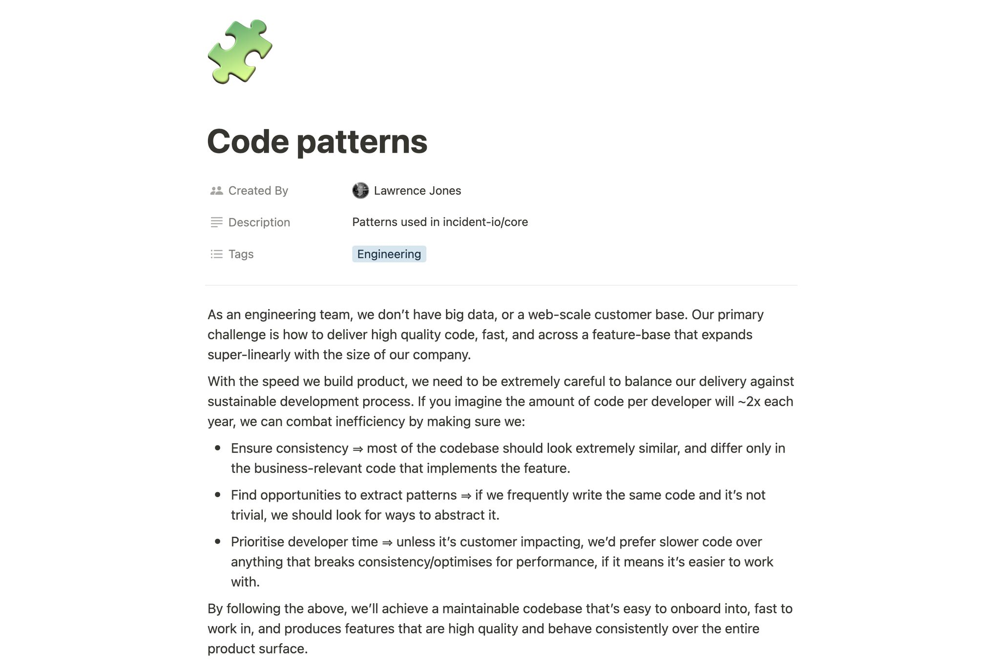
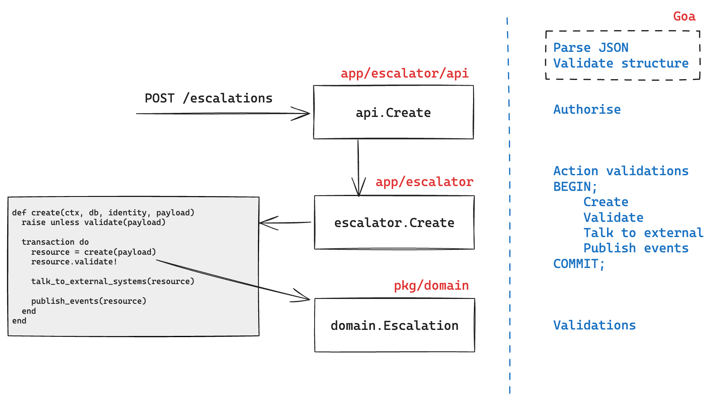

footer: 🔥 incident.io
theme: Plain Jane, 2
build-lists: true
slidenumbers: true
slidecount: true

# Pattern party

---

[.footer: ]

---

[.footer: ]

---

# Creating escalation paths

- [`api.Create`](https://github.com/incident-io/core/blob/master/server/app/escalationpath/api/service.go#L32-L53)
- [`escalationpath.Create`](https://github.com/incident-io/core/blob/master/server/app/escalationpath/create.go#L18)
- [`domain.EscalationPath.Validate`](https://github.com/incident-io/core/blob/master/server/pkg/domain/escalation_path.go#L171-L202)
- [`escalationpath.Update`](https://github.com/incident-io/core/blob/master/server/app/escalationpath/update.go#L31)
